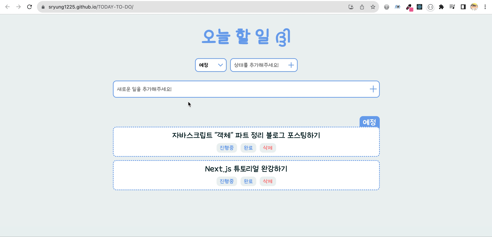
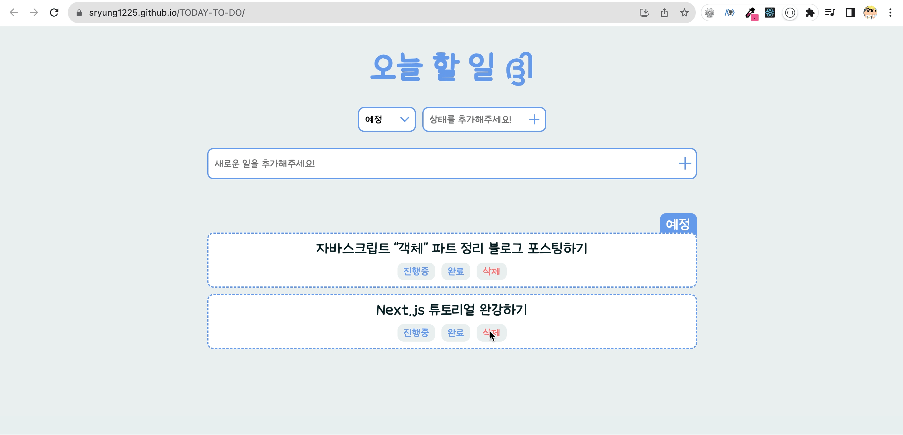
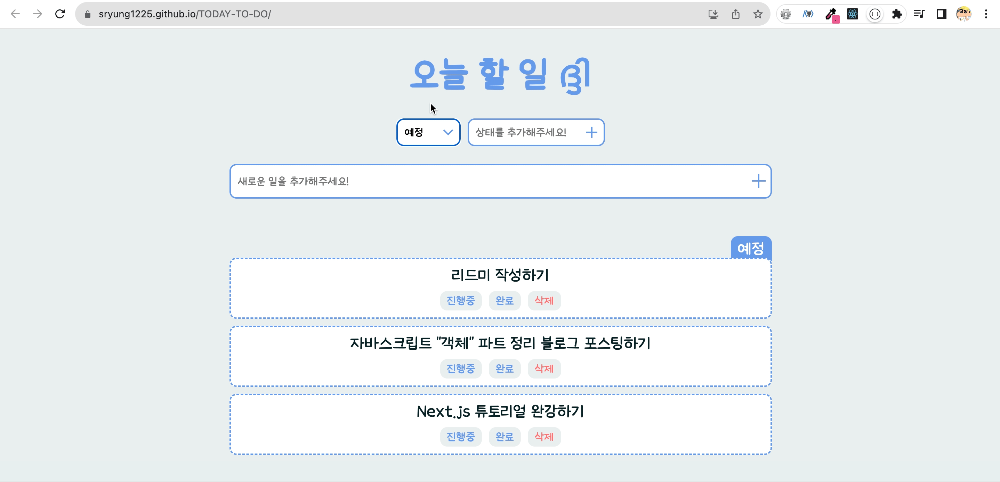
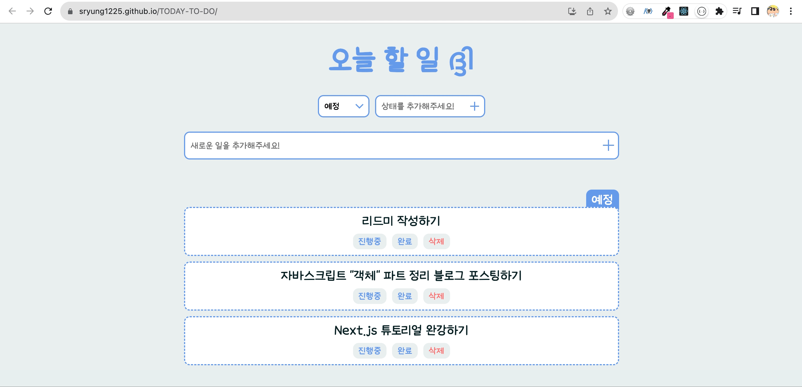
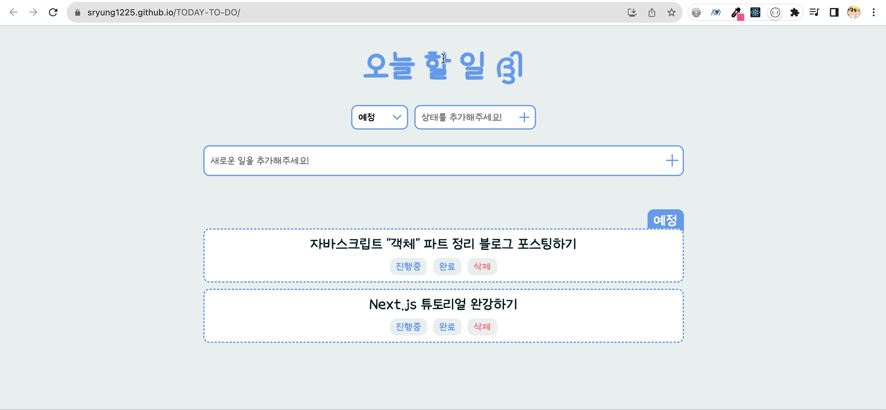

# 오늘 할 일 ദ്ദി

ReactJS와 TypeScript를 이용해서 <br>

to do 리스트를 제공하는 웹페이지 <b>"오늘 할 일"</b>을 제작했습니다.

> https://sryung1225.github.io/TODAY-TO-DO

 <br>

🚩 권장 사용 환경: Window10, MacOS Ventura, Chrome Browser <br>

🚩 사용 기술:      <br>

<br>

---

<br>

## 1️⃣ 할 일 작성하기

입력창에 할 일을 입력하면 현재 선택되어있는 상태를 기준으로 할 일이 등록됩니다. <br>

입력창은 react-hook-form 라이브러리를 이용해서 구현했습니다. <br>

```typescript
// CreateToDo.tsx
const setToDos = useSetRecoilState(toDoAtom);
const {
  register,
  handleSubmit,
  setValue,
  formState: { errors },
} = useForm<IForm>();
const handleValid = ({ toDo }: IForm) => {
  setToDos((oldToDos) => [
    { id: Date.now(), text: toDo, category },
    ...oldToDos,
  ]);
  setValue("toDo", "");
};

return (
  <S.ToDoForm onSubmit={handleSubmit(handleValid)}>
    <S.ToDoInput
      {...register("toDo", {
        required: "글자를 입력하고나서 추가 버튼을 눌러주세요.",
      })}
    />
  </S.ToDoForm>
);
```

글자를 입력하지 않고 등록하지 않는 경우, 경고를 노출하는 유효성 검사가 진행됩니다. <br>

조건에 맞게 글자가 입력된 경우 할 일 목록에 추가됩니다. <br>

 <br>

<br>

## 2️⃣ 할 일 목록 보기

작성된 할 일은 하단 목록에 나타납니다. <br>

전체 할 일 목록 중에서도 상단 좌측 select를 통해 선택된 상태에 해당되는 할 일 목록만이 노출됩니다. <br>

이 상태는 Recoil의 Selector를 이용해서 필터링됩니다. <br>

```typescript
// atoms.tsx
export const toDoSelector = selector({
  key: "toDoSelector",
  get: ({ get }) => {
    const toDos = get(toDoAtom);
    const category = get(categoryAtom);
    return toDos.filter((toDo) => toDo.category === category);
  },
});
```

 <br>

<br>

## 3️⃣ 상태 변경 / 삭제하기

할 일 각각은 현재의 상태를 제외한 나머지 상태 버튼들을 갖고 있습니다. <br>

이 버튼을 누름으로써 상태를 변경할 수 있습니다. <br>

또한 "삭제" 버튼을 통해 할 일을 완전히 삭제할 수도 있습니다. <br>

 <br>

<br>

## 4️⃣ 새로운 상태 추가하기

기본적으로 제공되는 상태는 "예정", "진행중", "완료" 3가지 입니다. <br>

사용자는 여기에서 새로운 상태를 추가해 함께 사용할 수 있습니다. <br>

 <br>

<br>

## 5️⃣ 로컬에서 관리하기

작성된 할 일 목록은 recoil persist를 통해 로컬 스토리지에서 관리됩니다. <br>

```typescript
// atoms.tsx
import { recoilPersist } from "recoil-persist";

const { persistAtom } = recoilPersist({
  key: "LocalToDos",
  storage: localStorage,
});
```

사용자는 서비스를 종료했다 다시 실행해도 이전에 작성한 할 일 목록을 확인할 수 있습니다. <br>

---

이론 및 세부 작업 정리 : [[📚 Notion](https://eve1225.notion.site/6-8-6-5-6-19-TO-DO-LIST-db20b2d644bd41daa69e2b97309cf811?pvs=4)] <br>
